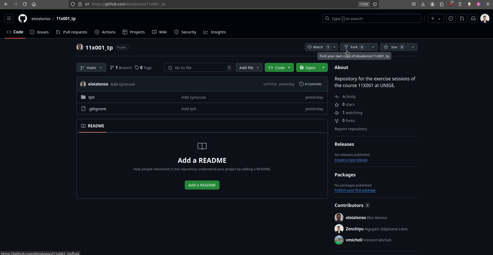
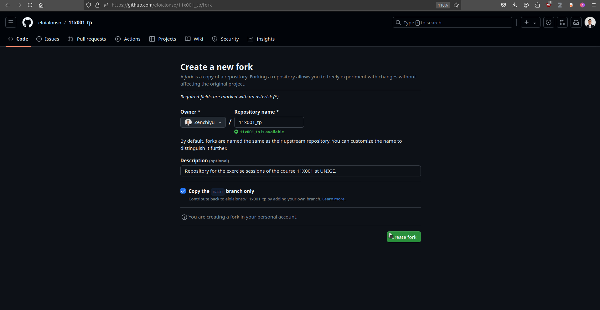
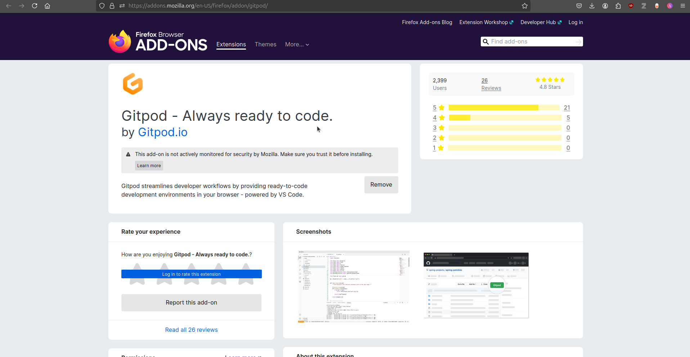

## Instructions pour bien commencer les TPs

- Créez un compte [gitpod](https://www.gitpod.io/) (try for free, vous aurez normalement 50h par mois)
- Créez un compte [GitHub](https://github.com/) (vous pouvez obtenir GitHub Pro avec l'Université)
- Allez sur la [page GitHub](https://github.com/eloialonso/11x001_tp) des exercices si pas déjà fait, puis `forker` le `repository` comme indiqué comme suit:




- Ajoutez ensuite l'extension GitPod sur votre navigateur ([Firefox](https://addons.mozilla.org/en-US/firefox/addon/gitpod/), [Chrome](https://chromewebstore.google.com/detail/gitpod/dodmmooeoklaejobgleioelladacbeki?hl=fr)):



## Chaque semaine

- Vous pouvez ensuite accéder à l'éditeur de texte en cliquant sur ce bouton:


- Ce qui ouvre ceci:


- Et pour mettre à jour vos fichiers, vous pouvez tapez dans le terminal

```
git merge upstream/main main
```

- Et lorsque vous avez fini de travailler, **veillez à stopper vos workspaces quand vous ne les utilisez pas!**


## Quelques raccourcis/commandes utiles

- Dans l'éditeur de texte :
    - Toggle le terminal : ctrl + j
    - Toggle l'explorer (à gauche): ctrl + b
- Dans le terminal :
    - Se déplacer dans le filesystem : `cd <chemin>`
    - Revenir un répertoire au dessus : `cd ..`
    - Voir les fichiers présents dans le répertoire courant : `ls` ou `ll`
    - **Lancer un code C** :
        - Compiler votre code source avec `clang <nom>.c -o <nom_executable>`
        - Exécuter avec `./<nom_executable>`
    - **Lancer un code Python** : `python <nom>.py`
